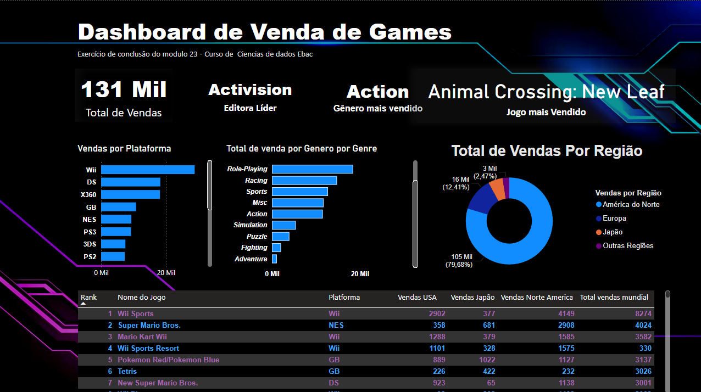

<div align="center">
  
  <br><br>
  
  <h1>📊 DASHBOARD DE E-COMMERCE</h1>
  <h2>Módulo 26 • Profissão Cientista de Dados</h2>
  
  <p><strong>Análise completa de transações + perfil de clientes • SQL + Python + Power BI</strong></p>

  <a href="https://github.com/ContatoRodrigoRibeiro/Dashboard-E-commerce---An-lise-SQL-Power-BI-M-dulo-26/blob/main/dados_ecommerce.pbix">
    
  </a>

  <br><br>

</div>

---

### 🔥 O que faz esse projeto ser foda

- **JOIN SQL** entre transações e dados pessoais dos clientes  
- Tratamento completo dos dados com Python + Pandas  
- Cálculo de **LTV (Lifetime Value)**, ticket médio e quantidade de transações por cliente  
- Exportação limpa para CSV com nomes em português  
- Dashboard interativo profissional no **Power BI**  
- Feito com paixão no Rio de Janeiro 🌊

<br>

## 📸 Preview do Dashboard




<br>

## 🛠️ Tecnologias Utilizadas

<div align="center">


</div>

<br>

## 📁 O que tem dentro do repositório

- `Profissao Cientista de Dados M26 Projeto_Respondido.ipynb` → Notebook completo com todo o código  
- `dados_ecommerce_final.csv` → Base tratada e limpa (pronta para usar)  
- `dados_ecommerce.pbix` → Arquivo do Dashboard Power BI  
- `TB_TRANSACOES_PROJETO_ECOMM.csv` e `TB_CLIENTES_PROJETO_ECOMM.csv` → Arquivos originais  
- `README.md` → Este arquivo

<br>

## 🚀 Como usar

1. Clone o repositório:
   ```bash
   git clone https://github.com/SEU_USUARIO/NOME_DO_REPO.git
